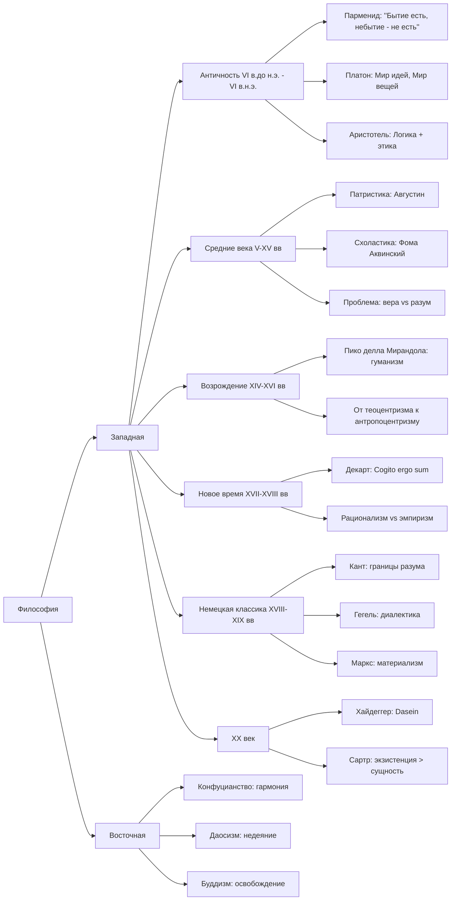

# Подготовка к экзамену по философии

## Общая структура



## Билеты

1. Понятие философии. Философия и критическое мышление.
2. Ранняя греческая философия (на примере концепции Парменида)
3. Греческая философия афинского периода: концепция Платона
4. Греческая философия афинского периода: концепция Аристотеля
5. Философия Средних веков и Возрождения: основная проблематика
6. Философия Нового времени (на примере концепции Р. Декарта)
7. Теоретическая философия И. Канта: "Критика чистого разума"
8. Практическая философия И. Канта: "Критика практического разума"
9. Г.В.Ф.Гегель: диалектический метод (основные принципы)
10. Социальная силософия К. Маркса (на примере "Капитала")
11. Философия XX века: экзистенциализм (М. Хайдеггер, Ж.П.Сартр)

## Структура ответа

В первых же предложениях сформулировать концепцию;  
Не столько важно рассказывать даты и историю, сколько сформулировать и объяснить
проблематику, приести свои примеры.  
Т.е. эказамен <ins>**по проблемам**</ins>, не по тексту/истории.

### Билет 1

#### Понятие философии. Философия и критическое мышление.

##### Проблематика

```text
Философ - это тот, кто научился сомневаться продуктивно,
не впадая в крайности всезнания и пофигизма.
```

##### Объяснение

Итак, начнём с этимологии:

- философия = **фило** + **софия**

С древнегреческого,

- фило - это любовь, стремление
- софия - мудрость

Получается, что философия - это буквально `стремление к мудрости`

Впервые термин насколько я помню использовался Пифагором, это 6 век до нашей
эры.

Контекст состоял в том, что когда Пифагора назвали мудрецом, он ответил что он
не мудрец (софос), а лишь любящий мудрость (философос).

##### Кто такой философ

На лекциях мы вводили 2 как бы "типа" людей, первые два из которых являются
крайностью философа.

1. Софисты (мудрецы).
2. Скептики.

Софисты - считают что обладают абсолютным знанием. Типичный софист в 2025 году
это человек на конференции плоскоземельщиков, который бьёт себя кулаком в грудь
и невзирая на все аргументы говорит что земля действительно таки плоская.

Какова их проблема? Очевидно они закрыты к какому-либо познанию, потому что
считают что они уже всё познали и их знание единственно и неповторимо
(абсолютно). Они не могут сомневаться в собственной мудрости, а как ещё что-то
познать, кроме как через сомнение.

Скептики же наоборот - считают чтоб абсолютного познания не существует как
такового. Почему это крайность спросите вы - да потому что они сомневаются что
вообще можно сомневаться.

Поясню, на примере с плоскощемельщиком - скептик легко разоблачит мудреца
плоскощемельщика и докажет ему что земля не плоская, но вот тут то и нюанс - он
не докажет что земля круглая и не будет искать другой истины, он лишь
опровергнет плоскоземельщика и придёт к тому, что земля никакая, нету истины
потому что.

Итак, **философ находится где-то между софистом и скептиком**. Философ
критически мыслит, сомневается в очевидном, он понимает что не может знать всё,
но также и пытается прийти к какой-то форме истины.

Например, мне очень нравится по этому поводу позиция `Сократа`:

```text
Я знаю, что я ничего не знаю.
```

То есть, как философ, с одной стороны я уже что-то знаю, потому что чтобы
понять, что я ничего не знаю, надо уже что-то да знать. С другой стороны, я как
раз открыт к познанию, говоря что чем больше я знаю, тем больше я буду ничего не
знать.

##### Критическое мышление

Философ должен уметь критически мыслить, но вопрос что это значит. Приведу
пример с практик - на занятиях были организованы дебаты, а также была задача
написать эссе, и в отличие от ЕГЭшного формата, где надо просто согласиться к
автором и прийти к какому-то выводу, на дебатах и в эссе я практиковался
занимать и аргументировать полностью противоположные позиции. Т.е. хороший
философ может ответить и да и нет на один и тот же вопрос, и при этом
аргументированно это обосновать.

**Это и есть критическое мышление** - сомневаться в очевидном, анализировать,
проверять источники, приходить к своим истинам и формулировать собственные
обоснованные выводы.
