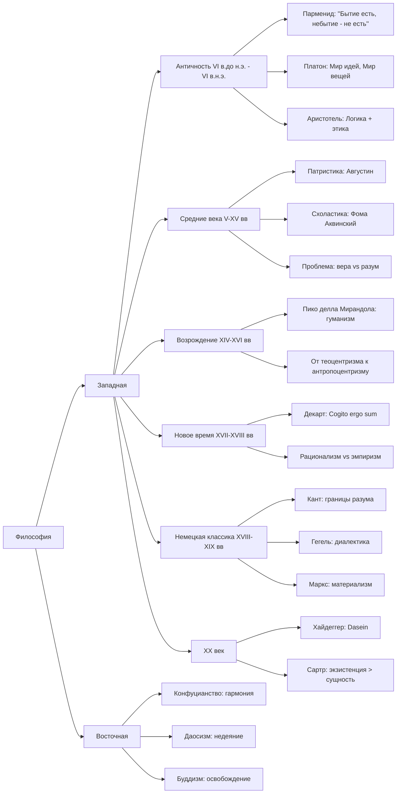

# Подготовка к экзамену по философии

## Общая структура



## Билеты

1. Понятие философии. Философия и критическое мышление.
2. Ранняя греческая философия (на примере концепции Парменида)
3. Греческая философия афинского периода: концепция Платона
4. Греческая философия афинского периода: концепция Аристотеля
5. Философия Средних веков и Возрождения: основная проблематика
6. Философия Нового времени (на примере концепции Р. Декарта)
7. Теоретическая философия И. Канта: "Критика чистого разума"
8. Практическая философия И. Канта: "Критика практического разума"
9. Г.В.Ф.Гегель: диалектический метод (основные принципы)
10. Социальная силософия К. Маркса (на примере "Капитала")
11. Философия XX века: экзистенциализм (М. Хайдеггер, Ж.П.Сартр)

## Структура ответа

В первых же предложениях сформулировать концепцию;  
Не столько важно рассказывать даты и историю, сколько сформулировать и объяснить
проблематику, приести свои примеры.  
Т.е. эказамен <ins>**по проблемам**</ins>, не по тексту/истории.

### Билет 1

#### Понятие философии. Философия и критическое мышление.

##### Проблематика

```text
Философ - это тот, кто научился сомневаться продуктивно,
не впадая в крайности всезнания и пофигизма.
```

##### Объяснение

Итак, начнём с этимологии:

- философия = **фило** + **софия**

С древнегреческого,

- фило - это любовь, стремление
- софия - мудрость

Получается, что философия - это буквально `стремление к мудрости`

Впервые термин насколько я помню использовался Пифагором, это 6 век до нашей
эры.

Контекст состоял в том, что когда Пифагора назвали мудрецом, он ответил что он
не мудрец (софос), а лишь любящий мудрость (философос).

##### Кто такой философ

На лекциях мы вводили 2 как бы "типа" людей, первые два из которых являются
крайностью философа.

1. Софисты (мудрецы).
2. Скептики.

Софисты - считают что обладают абсолютным знанием. Типичный софист в 2025 году
это человек на конференции плоскоземельщиков, который бьёт себя кулаком в грудь
и невзирая на все аргументы говорит что земля действительно таки плоская.

Какова их проблема? Очевидно они закрыты к какому-либо познанию, потому что
считают что они уже всё познали и их знание единственно и неповторимо
(абсолютно). Они не могут сомневаться в собственной мудрости, а как ещё что-то
познать, кроме как через сомнение.

Скептики же наоборот - считают чтоб абсолютного познания не существует как
такового. Почему это крайность спросите вы - да потому что они сомневаются что
вообще можно сомневаться.

Поясню, на примере с плоскощемельщиком - скептик легко разоблачит мудреца
плоскощемельщика и докажет ему что земля не плоская, но вот тут то и нюанс - он
не докажет что земля круглая и не будет искать другой истины, он лишь
опровергнет плоскоземельщика и придёт к тому, что земля никакая, нету истины
потому что.

Итак, **философ находится где-то между софистом и скептиком**. Философ
критически мыслит, сомневается в очевидном, он понимает что не может знать всё,
но также и пытается прийти к какой-то форме истины.

Например, мне очень нравится по этому поводу позиция `Сократа`:

```text
Я знаю, что я ничего не знаю.
```

То есть, как философ, с одной стороны я уже что-то знаю, потому что чтобы
понять, что я ничего не знаю, надо уже что-то да знать. С другой стороны, я как
раз открыт к познанию, говоря что чем больше я знаю, тем больше я буду ничего не
знать.

##### Критическое мышление

Философ должен уметь критически мыслить, но вопрос что это значит. Приведу
пример с практик - на занятиях были организованы дебаты, а также была задача
написать эссе, и в отличие от ЕГЭшного формата, где надо просто согласиться к
автором и прийти к какому-то выводу, на дебатах и в эссе я практиковался
занимать и аргументировать полностью противоположные позиции. Т.е. хороший
философ может ответить и да и нет на один и тот же вопрос, и при этом
аргументированно это обосновать.

**Это и есть критическое мышление** - сомневаться в очевидном, анализировать,
проверять источники, приходить к своим истинам и формулировать собственные
обоснованные выводы.

### Билет 2

#### Ранняя греческая философия (на примере концепции Парменида)

##### Концепция Парменида

Парменид из Элеи первым поставил вопрос о том, что значит существовать и
установил принцип: то, что можно мыслить - существует, а то, что нельзя
мыслить - не существует. Заложил основы логического мышления (показал принцип
непротиворечия), поставил метафизические вопросы.

##### Чуть истории

До Парменида философы задавались вопросами - "Из ЧЕГО состоит мир?"

- Фалес говорил: "Из воды"
- Анаксимен говорил: "Из воздуха"
- Гераклит говорил: "Всё течёт, огонь - первоначало"

Парменид - первый "метафизик" - поднял другой вопрос - не из чего состоит бытие,
а что такое вообще **БЫТИЕ**?

> Понятие метафизики не существовало во времена Парменида и будет введено только
> учениками Аристотеля при анализе работ "после физики" (буквально -
> метафизика).

Если Гераклит говорил что всё течёт, Парменид сказал - ничего не течёт, ничего
не меняется.

Он основал Элейскую школу в Южной Италии, где впервые поставил разум выше
чувств.

##### Логика Парменида

Парменид заложил основу формальной логики: "А не может быть не-А одновременно"

1. Если я думаю о чём-то - это что-то есть в моей мысли
2. Если есть в мысли - то это бытие
3. Небытие НЕЛЬЗЯ помыслить
4. Значит, `Бытие есть, а небытие - не есть`

То есть ещё раз, попробуйте помыслить о "ничём". Не получается! Потому что даже
думая о "ничём", вы думаете о понятии "ничего". Значит, мышление всегда связано
с бытием.

##### Пути познания Парменида

Парменид написал поэму "О природе", где богиня открывает истину:

1. Путь истины (алетейя)

- путь разума и логики
- достоверное знание через _мышление_

2. Путь мнения (докса)

- путь чувств и материального восприятия
- недостоверное знание через _ощущения_

##### Формулировка Парменида

Мы видим что мир изменяется, но логика говорит, что изменение невозможно

Логика:

1. Чтобы измениться, надо _перестать быть_ тем, что ты есть
2. Но `перестать быть` = небытие
3. А небытия - **нет!**
4. Значит, `изменение - иллюзия чувств`

Отсюда получаем,

```text
Истинное бытие - неизменно
Изменения - иллюзия
```

Например, гуляя по парку можно лицезреть кроны деревьев. Летом они зелёные, а
осенью - жёлтые, красные, оранжевые. По Пармениду, это иллюзия чувств - мы
наблюдаем цвета глазами. Истинное бытие листа и кроны из листьев (её сущности)
остаётся неизменным.

##### Вытекает главная проблема Парменида:

Мы видим только изменения. Живём в мире, где всё вокруг постоянно меняется. Как
нам вообще познать истинное бытие, если оно неизменно, а неизменность мы не
видим? Получается, что всё вокруг - иллюзия.

> Эту проблему Парменида потом гениально решил Платон, разделив реальность на
> мир идей (где истина неизменна) и мир вещей (где мы видим изменения).

### Билет 3

#### Греческая философия афинского периода: концепция Платона

##### Концепция Платона

Концепция Платона заключается в теории мира идей, вещей и теней, чтобы решить
проблему Парменида о том, как познать неизменную истину в изменчивом мире.

##### Проблема Парменида

Парменид говорил:

```
Истинное бытие - неизменно
Изменения - иллюзия
```

Отсюда вопрос, как мы вообще живя в изменчивом мире можем познать неизменное
истинное бытие? Получается, что тогда всё это иллюзия.

##### Решение Платона

Платон не отвергает Парменида, а развивает его идеи. Он гениально решает эту
проблему - делит реальность на пирамиду:

1. Мир идей
2. Мир вещей
3. Мир теней

Где тут решение - есть неизменный мир идей, то есть Парменид прав, в котором
истина. Душа бессмертна и до рождения жила в мире идей, то есть знала всю
истину.

При рождении душа "забывает" об истине, она становится заключена в теле
человека. Человек живёт в мире вещей. В нём есть материальные копии, которые
причастны к идеям, отсюда фраза
`бытие - это отношение причастности вещей к идеям`, потому что вещи причастны к
идеям. Т.е. конкретный стол причастен к идее стола. Он имеет некоторую
_"стольность"_.

Познание возможно только с помощью разума - это анамнезис, когда мы
"припоминаем" с помощью разума идеи, которые душа помнила когда-то раньше.

Тут хочется привести интересный пример - это диалог Диогена с Платоном: Диоген
говорит: "Я вижу чашу, но не вижу чашность" На что Платон отвечает: "У тебя есть
глаза, чтобы видеть чашу, но нет разума, чтоб видеть чашность"

Суть тут в том, что чаша - это предмет материального мира. Диоген видит её
своими глазами. А идея чашности может быть познана только через разум.

Дальше чуть про мир теней - это самый низкий уровень познания, когда люди
принимают копии копий, т.е. отражения за реальность.

В реальном мире это например когда мы судим о человеке по его фото в инстаграмме

Чтоб ещё лучше познать концепцию познания мира Платона обратимся к его мифе о
пещере:

Пересказывая вкраце, в нём заключённые сидят спиной к выходу из пещеры и видят
тени происходящих за ними событий. В какой-то момент один из заключённых
освобождается и выходит из пещеры, видит мир таким какой он есть. Но когда
возвращается в пещеру чтоб поведать истинное знание - ему не верят.

Тени на стене - это мир теней, где люди пытаются познать реальность по
отражениям. Предметы за спиной - это мир вещей А солнце снаружи пещеры - это мир
идей.

Отсюда цель философа - поведать обычным людям, живущим в мире теней, об истине,
о мире вещей и идей.

Тут можно привести пример со смешной картинкой (показать на экзамене?), где
заключённые видят отражения осей - windows и macOs, а когда философ выходит из
пещеры - он видит Linux (солнце). Но когда возвращается и говорит им о
существовании такого идеала, ему не верят.

### Билет 4

#### Греческая философия афинского периода: концепция Аристотеля

##### Концепция

Аристотель создал систематическую метафизику, где каждая вещь состоит из материи
(возможности) и формы (действительности), и объясняется через 4 причины, чтобы
решить проблему Платона о том, как идеи связаны с материальным миром.

Хоть Аристотель и был учеником Платона, он по итогу его как бы переосмыслил,
придумав основу для всех наук и систематизировав их, а также решил проблему
Платона

##### Проблема Платона

Если идеи в отдельном мире, как они влияют на наш, материальный мир? Как стол
связан с идеей стола?

Решение Аристотеля: "Идеи не в отдельном мире, а в САМИХ ВЕЩАХ как слияние формы
с материей"

Пример: конкретный стол = материя (дерево) + форма (идея стола) => не нужен
отдельный "мир идей"

##### Метафизика Аристотеля

Это теория всего, о началах всего

Главный вопрос: "Что есть сущее?"

Сущее разделяется на 10 категорий, которые делятся на 2 группы:

1. Безусловное сущее - сущность (лат. `субстанция`)

   - ЧТО это? => **стол, собака, человек, камень**
   - существует _само по себе_

2. Остальные 9 существуют как _отношение сущности_ - привходящее-приключение
   (то, что приходит к субстанции) (лат. `акцинденция`): место, время,
   количество, качество, ...
   - То, что существует _ТОЛЬКО В ДРУГОМ_
   - ГДЕ? => **в комнате**
   - КОГДА? => **сегодня**
   - СКОЛЬКО? => **один**
   - КАКОЙ? => **КОРИЧНЕВЫЙ**

Резюмируя,

```text
Сущность существует сама по себе
Акциденции зависят от сущности
```

Простой тест: "Может ли это существовать отдельно?"

1. "Да!" => Субстанция (e.g. Стол)
2. "Нет!" => акциденция (e.g. один, коричневый; <- тут нужно зависимое)

Также, сущее может быть описано как:

- сущее возможности (греч. `дюнамис`) - слабее
  - то, чем вещь МОЖЕТ СТАТЬ
  - потенциал, ещё не реализованный
- сущее действительности (греч. `энергия`) - сильнее, основание для возможности
  - то, чем вещь УЖЕ ЯВЛЯЕТСЯ
  - реализованный потенциал

Возможное начало сущности - материя  
Действительное начало сущности - форма

```text
Желудь может стать дубом только потому,
что УЖЕ ЕСТЬ ВЗРОСЛЫЕ ДУБЫ

Получается, что возможности определяются тем,
что УЖЕ СУЩЕСТВУЕТ В ДЕЙСТВИТЕЛЬНОСТИ

Возможное начало жёлудя - это его материя,
  древесное вещество, клетчатка

Действительное начало жёлудя - это его форма,
  "дубовость", программа стать дубом
```

##### 4 причины описания сущего

Так что принципиально нового в метафизике?

Надо осмыслить причины всего мира, т.к. Платон так этого и не сделал

есть 4 причины чтоб описать сущее <=> 4 начала всего на свете

1. Материальная причина (из чего всё произошло?). Материя - вечна. Её нелььзя
   создать/уничтожить. (**ЭТО И ЕСТЬ ДЮНАМИС - ВОЗМОЖНОСТЬ**)
2. Формальная причина (что всё определяет? сущность?). Придаёт материи форму.
   Есть первоформа - источник остальных форм. Некий ум, или "Бог". Тут и
   схожесть и разница с Платоном. Но если Платон придумал отделное царство - мир
   идей. То у Аристотеля форма сливается с материей в конкретном предмете.
   (**ЭТО И ЕСТЬ ЭНЕРГИЯ - ДЕЙСТВИТЕЛЬНОСТЬ**)
3. Производщящая причина. То, откуда всё происходит. Бог, большой взрыв, или
   какой-то другой источник вселенной.
4. Конечная цель. То, ради чего всё существует. У каждой вещи есть своя цель
   существования. Для чеовека это смысл жизни, а высшая цель всего - есть Благо.

Итак, `желудь`,

1. Материальная - древесное вещество
2. Формальная - идея дуба (форма)
3. Производящая - солнце, вода
4. Целевая - стать дубом

##### Система наук Аристотеля

Есть 3 вида наук - теоретические, практические, творческие

теоретические - знания ради знаний (математика, физика, метафизика)
практические - знания ради пользы (политика, этика)  
поэтические - развитие творчества, создание предметов искусства (риторика,
искусство)

Интересный факт: во время Аристотеля метафизики ещё не существовало, поэтому он
назвал её "первой философией" - потому что она и есть начала, теория всего. А
слово метафизика придумали его ученики, когда нашли его рукописи буквально "то,
что после физики".

##### Иерархия Бытия Аристотеля

Чем больше формы над материей, тем выше в иерархии:

- Камень - мало формы, много материи
- Растение - больше формы (растет к цели)
- Животное - еще больше формы (движется, чувствует)
- Человек - много формы (разум)
- БОГ - чистая форма, никакой материи

##### БОГ КАК "НЕПОДВИЖНЫЙ ДВИГАТЕЛЬ"

- Парадокс движения: Кто движет все во вселенной?
- Решение Аристотеля: Бог не движется сам (**он совершенен**), но движет все
  остальное, как предмет любви движет влюбленного.
- В Боге нет возможности - только чистая действительность, все уже реализовано.

##### ЭНТЕЛЕХИЯ

Внутренняя цель - сила, которая ведет к совершенству.

Пример: В желуде есть энтелехия дуба - сила, которая делает его дубом, а не
березой.

##### Ответ Аристотеля на Апорию Зенона

> Апория - это неразрешимая логическая проблема Зенон - ученик Парменида,
> который его защищал

Условие: Ахиллес догоняет черепаху, которая имеет фору

Пока Ахиллес добежит до точки А, где была черепаха, она уползёт до точки Б. Пока
добежит до Б, она уползёт в В Пока добежит до В, она уползёт в Г И так далее...
Вывод: Ахиллес НИКОГДА не догонит черепаху

Ответ Аристотеля: Зенон путает Математическое деление и Физическое движение,
ошибочно предполагая что если математически можно делить бесконечно, то и
физически нужно бесконечное время.

Пример: Математически путь можно поделить на бесконечное количество отрезков, а
физически этот путь преодолеть за 10 секунд.

##### ПРОСТАЯ СХЕМА СВЯЗЕЙ

```text
КАЖДАЯ ВЕЩЬ состоит из:

МАТЕРИЯ = ДЮНАМИС = ВОЗМОЖНОСТЬ = МАТЕРИАЛЬНАЯ ПРИЧИНА
    ↓
ФОРМА = ЭНЕРГИЯ = ДЕЙСТВИТЕЛЬНОСТЬ = ФОРМАЛЬНАЯ ПРИЧИНА

+ ДВИЖУЩАЯ ПРИЧИНА (кто запустил)
+ ЦЕЛЕВАЯ ПРИЧИНА (зачем)
```

##### СВЯЗЬ С ИСКУССТВОМ

- Классическое искусство - торжество формы над материей (четкие пропорции,
  симметрия, идеальная перспектива, подавление эмоций ради красоты, логическая
  композиция).
- Барокко, романтизм - избыток материи над формой (эмоции, хаос, резкие
  светотени, нарушение симметрии ради драматизма).

Например, девятый вал - избыток материи над формой. Важно показать мощь морской
бури, пробивание восхода солнца, людей на обломках после краблекрушения,
перезать ужас стихии и надежду на спасение людей, передать динамику и хаос
стихии. Картина заставлвяет переживать, а не любоваться пропорциями.

### Билет 5

#### Философия Средних веков и Возрождения: основная проблематика

### Билет 8

#### Практическая философия И.Канта: «Критика практического разума»

##### Основная проблема Канта:

**Практическая философия Канта - это ответ на вопрос: "Как быть нравственным в
мире, где всё подчиняется законам природы?" Как совместить человеческую свободу
и моральную ответственность с научной картиной мира?**

##### Главная проблематика:

Кант видит противоречие: с одной стороны, наука говорит, что всё в мире (включая
человека) подчиняется строгим законам причинности. С другой стороны, мораль
требует, чтобы человек был свободен и отвечал за свои поступки.

**Центральный вопрос:** Если всё моё поведение предопределено законами природы
(генами, воспитанием, обстоятельствами), то могу ли я быть морально
ответственным? Есть ли у меня вообще выбор?

**Проблема:**

- **Если человек не свободен** → нет морали, нет ответственности, нет
  человеческого достоинства
- **Если человек свободен** → как это возможно в прично-следственном
  (детерминированном) мире науки?

##### Решение Канта: человек как гражданин двух миров

###### 1. Два мира человеческого существования

**Мир природы (феноменальный):**

- Здесь действуют законы физики, химии, биологии
- Всё предопределено причинно-следственными связями
- Человек как физическое существо подчиняется этим законам

**Мир разума (ноуменальный):**

- Здесь действуют законы морали
- Человек как разумное существо способен к свободному выбору
- Источник нравственности и человеческого достоинства

**Пример:**

- Как физическое тело, ты подчиняешься гравитации
- Как моральное существо, ты можешь выбирать между добром и злом

###### 2. Свобода как автономия воли

**Что такое автономия воли:**

- Способность самому устанавливать для себя моральные законы
- Не подчинение внешним принуждениям (страх, выгода, традиции)
- Действие из чувства долга, а не из склонности

**Противоположность - гетерономия:**

- Действия под влиянием внешних факторов
- "Поступаю так, потому что боюсь наказания"
- "Делаю это ради выгоды"

##### Практические аспекты. Категорический `императив` - основной закон нравственности

```text
Императив = повеление, команда
```

**Гипотетический императив:** "Если хочешь X, то делай Y"

- Зависит от твоих желаний и целей

**Категорический императив:** "Делай Y независимо от обстоятельств"

- Безусловное моральное требование
- Не зависит от твоих желаний, выгод, последствий

###### Три формулировки категорического императива

**1. Формула всеобщего закона:** **"Поступай только согласно такой максиме,
которую ты мог бы пожелать сделать всеобщим законом"**

**Проверка поступка:**

- Сформулируй правило своего действия
- Представь, что ВСЕ люди будут действовать по этому правилу
- Если мир при этом не рухнет - поступок морален

**Пример:**

- Правило: "Можно лгать, когда это выгодно"
- Если все будут лгать → никто никому не поверит → общение станет невозможным
- Вывод: лгать безнравственно

**2. Формула человечности:** **"Поступай так, чтобы ты всегда относился к
человечеству и в своем лице, и в лице всякого другого как к цели, и никогда не
относился бы к нему только как к средству"**

**Что это означает:**

- Каждый человек - цель сам по себе, а не инструмент
- Нельзя использовать людей только для своих целей
- Уважай достоинство каждого человека

**Примеры нарушения:**

- Рабство: человек только средство производства
- Обман: используешь доверие другого для своей выгоды
- Манипуляции: человек только инструмент достижения цели

**Примеры соблюдения:**

- Честная торговля: взаимная выгода, никого не обманываешь
- Образование: развиваешь способности человека, а не только готовишь работника

**3. Формула автономии:** **"Идея воли каждого разумного существа как воли,
устанавливающей всеобщие законы"**

**Суть:** Ты не просто подчиняешься моральному закону, а сам его создаешь как
разумное существо.

**Это значит:**

- Моральный закон не навязан извне (Богом, обществом, природой)
- Ты сам, как разумное существо, приходишь к нему
- Поэтому ты свободен, даже подчиняясь моральному закону

###### Как работает на практике

**Ситуация:** Друг просит одолжить денег, но ты знаешь, что он не вернет.

**Проверка по 1-й формуле:**

- Правило: "Лги, чтобы не обидеть друга"
- Если все будут лгать из вежливости → правда исчезнет
- Вывод: надо сказать правду

**Проверка по 2-й формуле:**

- Лгать = использовать друга как средство (сохранить свой комфорт)
- Сказать правду = относиться к нему как к разумному существу, способному понять
- Вывод: правда уважает его достоинство

##### Взаимосвязь свободы и морального закона

###### Парадокс Канта

**Проблема:** Как доказать, что человек свободен, если наука показывает, что всё
детерминировано?

**Решение Канта:** Моральный закон в нашем сознании ДОКАЗЫВАЕТ нашу свободу.

**Логика:**

1. Мы осознаем в себе моральный долг ("должен поступать нравственно")
2. Но "должен" имеет смысл только если "могу"
3. Если бы мы не были свободны, моральные требования были бы бессмысленны
4. Значит, раз мораль существует → мы свободны

###### Формула Канта:

**"Моральный закон во мне" и "звездное небо надо мной"**

- Звездное небо = порядок природы, детерминизм
- Моральный закон = свобода, человеческое достоинство
- Оба одинаково реальны и удивительны

##### Постулаты практического разума

```text
Постулаты = то, что нельзя доказать теоретически, но что необходимо принять для морали.
```

**Три постулата:**

###### 1. Постулат свободы

**Смысл:** Человек должен быть свободен, иначе мораль невозможна.

**Обоснование:** Моральный долг предполагает свободу выбора.

###### 2. Постулат бессмертия души

**Проблема:** Нравственное совершенство недостижимо в конечной жизни.

**Логика:**

- Моральный закон требует быть совершенным ("святым")
- В земной жизни мы всегда остаемся несовершенными
- Значит, должна быть возможность бесконечного приближения к идеалу
- Для этого нужно бессмертие души

**Пример:** Ты всю жизнь стремишься стать лучше, но всегда остаются недостатки.
Справедливость требует, чтобы у тебя была возможность продолжить это стремление.

###### 3. Постулат бытия Бога

**Проблема:** В мире добродетель и счастье не совпадают.

**Что мы видим:**

- Хорошие люди часто страдают
- Плохие люди часто преуспевают
- Справедливость не восторжествует сама собой

**Логика Канта:**

- Моральный закон требует высшего блага = единство добродетели и счастья
- В природном мире это единство не гарантировано
- Значит, должен существовать Бог как гарант справедливости

**NB:** Это не доказательство бытия Бога, а практическая необходимость в него
верить.

##### Антиномия практического разума

###### Противоречие в моральном мире

**Тезис:** Стремление к счастью должно порождать добродетель

- Если ты счастлив, то становишься добрее

**Антитезис:** Добродетель должна порождать счастье

- Если ты добродетелен, то заслуживаешь счастья

**Проблема:** В реальном мире ни то, ни другое не работает автоматически.

**Решение:** Высшее благо возможно только при условии бытия Бога, который
обеспечит справедливое воздаяние.

##### Практическое значение кантовской этики

**1. Защита человеческого достоинства**

- Каждый человек имеет абсолютную ценность
- Никого нельзя использовать только как средство

**2. Обоснование ответственности**

- Даже в детерминистском мире у нас есть моральная свобода
- Мы отвечаем за свои поступки

**3. Универсальные принципы морали**

- Нравственность не зависит от культуры, религии, эпохи
- Разум сам может найти моральные законы

###### Проблемы кантовской этики:

**1. Чрезмерная строгость:** Нет места компромиссам и исключениям (e.g. нельзя
лгать даже чтобы спасти жизнь)

**2. Игнорирование эмоций:** Только разум, без учета чувств

**3. Формализм:** Важна форма поступка, а не результат

##### Итог практической философии Канта:

**Ключевая идея:** Человек одновременно принадлежит миру природы (как физическое
существо) и миру свободы (как моральное существо). Это и есть источник
человеческого достоинства.

> Если задуматься, между Кантом и экзистенциализмом (который будет дальше по
> билетам) есть глубокая связь. По сути исторически одно пошло от другого,
> экзистенциалисты взяли у Канта проблему свободы, но отвергли его веру в разум
> и универсальные принципы. Если Кант считал, что основа морали - разум и что
> все люди, честно размышляя, придут к одним моральным выводам, потому что разум
> у всех устроен одинаково, экзистенциалисты сказали, что существование первично
> перед разумом и в реальности каждый человек уникален и должен сам создавать
> свои ценности, так что выбор часто иррационален и зависит от ситуации.

### Билет 9

#### Г.В.Ф.Гегель: диалектический метод (основные принципы)

##### Основная проблема Гегеля:

**Диалектика Гегеля - это объяснение того, как все в мире развивается через
противоречия и конфликты, которые ведут не к разрушению, а к новому уровню
развития**

**Центральный вопрос:** Что является движущей силой развития? Как из хаоса
противоречий рождается порядок и прогресс?

**Ответ Гегеля:** Развитие происходит через диалектику - столкновение
противоположностей, которое порождает нечто новое и более высокое.

##### Принцип 1: Диалектическая триада (тезис-антитезис-синтез)

**1. Тезис** - исходное утверждение, позиция, состояние

**2. Антитезис** - противоположное утверждение, отрицание тезиса

**3. Синтез** - новое состояние, которое вбирает в себя "рациональные зерна" из
тезиса и антитезиса

**Пример: Развитие общества**

- **Тезис:** Феодализм (личная зависимость, натуральное хозяйство)
- **Антитезис:** Критика феодализма, стремление к свободе
- **Синтез:** Капитализм (формальная свобода + рыночные отношения)

**NB:** Синтез не просто "компромисс", а качественно новое состояние, которое
превосходит и тезис, и антитезис.

##### Принцип 2: Единство и борьба противоположностей

**В любом явлении одновременно существуют противоположные стороны, которые:**

- Не могут существовать друг без друга (единство)
- Постоянно конфликтуют между собой (борьба)
- Этот конфликт и есть источник развития

##### Примеры:

**В природе:**

- Жизнь-смерть: смерть клеток обновляет организм
- День-ночь: смена циклов обеспечивает жизнь на Земле
- Притяжение-отталкивание: основа физических процессов

**В обществе:**

- Консерватизм-прогрессизм: стабильность vs изменения
- Индивидуализм-коллективизм: личные vs общественные интересы
- Порядок-свобода: безопасность vs творческое проявление

**Ключевая идея:** Противоречие не зло, которое нужно устранить, а источник
развития!

##### Принцип 3: Переход количественных изменений в качественные

**Развитие происходит не плавно, а скачками:**

- Сначала накапливаются количественные изменения
- В критической точке происходит качественный скачок
- Возникает принципиально новое качество

##### Примеры:

**В природе:**

- Нагрев воды: 99°C - еще вода, 100°C - уже пар
- Эволюция: накопление мутаций → появление нового вида
- Качался, качался → взял сотку от груди на раз

**В обществе:**

- Революции: накопление недовольства → взрыв, смена строя
- Технологический прогресс: множество изобретений → цифровая эра

##### Принцип 4: Отрицание отрицания (как Де Морган, но сложнее)

**Развитие идет по спирали, а не по кругу:**

- Первое отрицание: отказ от исходного состояния
- Второе отрицание: отказ от первого отрицания
- Результат: возврат к исходному, но на более высоком уровне

##### Пример: Политическое развитие

**1. Традиционная монархия:** Власть от Бога, подданные безропотно повинуются

**2. Буржуазная демократия:** Отрицание монархии, власть от народа

**3. Более высокая форма демократии:** Сохраняет народовластие, но преодолевает
недостатки буржуазной демократии

**NB:** Это не простое возвращение назад, а движение вперед с сохранением
позитивного опыта.

##### Как всё работает в системе Гегеля

###### Абсолютная идея и её самопознание

**Центральная идея Гегеля:** Весь мир - это процесс самопознания Абсолютной идеи
(Мирового разума, Бога) через диалектические противоречия.

**Если по человечески:** Вся реальность - это как гигантский мозг, который
познает сам себя, проходя через конфликты и противоречия.

###### Три стадии развития Абсолютной идеи:

**1. Логика** - идея "в себе" (чистое мышление)

- Абстрактные понятия и их диалектическое развитие
- Пример: Бытие → Ничто → Становление

**2. Философия природы** - идея "вне себя" (материальный мир)

- Идея отчуждает себя в природе, становится внешней
- Диалектика: неорганическая природа → органическая → человек

**3. Философия духа** - идея "для себя" (возвращение к себе)

- Через человеческое сознание идея познает саму себя
- Диалектика: индивидуальное сознание → общество → абсолютный дух

##### Диалектика в действии: развитие сознания

**Индивидуальное сознание:**

**1. Чувственная достоверность** (тезис)

- "Я вижу вот это дерево"
- Кажется самым надежным знанием

**2. Восприятие** (антитезис)

- "Но дерево меняется: то зеленое, то желтое"
- Сомнение в непосредственном знании

**3. Рассудок** (синтез)

- "Дерево - это единство различных свойств"
- Понимание через понятия

##### Диалектика истории

> По Гегелю, история - это прогресс в сознании свободы

**1. Восточный мир:** Свободен один (деспот)

- Остальные - рабы

**2. Греко-римский мир:** Свободны некоторые (граждане)

- Но есть рабы

**3. Германский мир:** Свободны все люди

- Христианство + современное государство

**Диалектический механизм:** Каждая эпоха содержит внутренние противоречия,
которые ведут к ее преодолению и переходу к более высокой форме.

##### Практическое значение диалектического метода

**1. В познании:**

- Не бойся противоречий - они двигают мысль вперед
- Истина не в односторонних утверждениях, а в процессе развития

**2. В истории:**

- Кризисы и конфликты не случайны - они необходимы для прогресса
- Даже негативные явления играют позитивную роль в общем развитии

**3. В личном развитии:**

- Внутренние конфликты - не проблема, а возможность роста
- Каждый кризис может стать ступенью к новому уровню

##### Знаменитая фраза Гегеля:

```text
"Все действительное разумно, все разумное действительно"
```

**Не значит:** "Всё, что есть - хорошо"

**Значит:** "Всё, что происходит, имеет свою логику в общем процессе развития"

##### Итог диалектического метода:

**Главная идея:** Мир не хаос, а логически развивающаяся система, где
противоречия - не препятствие, а движущая сила прогресса.

> Гегель показал, что стабильность - иллюзия, а изменение - единственная
> константа.

### Билет 10

#### Социальная философия К.Маркса (на примере «Капитала»)

##### Основная проблема Маркса:

Социальная философия Маркса - это объяснение того, почему при капитализме
богатые становятся богаче, а бедные остаются бедными, и как это исправить

Маркс смотрит на общество и видит странность: рабочие создают всё богатство, но
сами остаются бедными. Капиталисты ничего не производят, но становятся всё
богаче.

**Центральный вопрос**: Откуда берется прибыль капиталиста? Почему система
работает так, что одни эксплуатируют других? И как это изменить?

##### Анализ капитализма: две формулы обмена

1. Нормальная торговля: Т - Д - Т (товар → деньги → товар)

> Продал молоко за 100 рублей, купил хлеб за 100 рублей
>
> Цель: получить нужный товар

2. Капиталистическая схема: Д - Т - Д' (деньги → товар → больше денег)

> Вложил 100 рублей, получил 120 рублей
>
> Цель: получить прибыль

**Проблема**: Откуда берутся эти дополнительные 20 рублей (Д')? Ведь если все
обмениваются "честно", прибыли быть не должно!

А оказывается, существует такой товар, который СОЗДАЕТ стоимость при
использовании. Называется он

##### Рабочая сила

- Обычные товары (хлеб, молоко, etc.) - их стоимость не увеличивается при
  потреблении. Съел хлеб - он исчез.
- Рабочая сила: Единственный товар, который при потреблении СОЗДАЕТ новую
  стоимость.

Труд = реальная работа (действительное)

Рабочая сила = способность работать (потенциальное)

```text
То есть ты не продаешь капиталисту "8 часов работы". Ты продаешь свою СПОСОБНОСТЬ работать 8 часов.
```

##### Механизм эксплуатации

- Капиталист покупает рабочую силу за ее стоимость

> Стоимость рабочей силы = сколько нужно, чтобы рабочий мог жить и работать
> (еда, жилье, одежда) - условно 1000 руб/день

- Но потребительная стоимость рабочей силы - ее способность создавать стоимость

> За 8 часов работник создает товаров на 2000 рублей

**Результат:**

Капиталист заплатил: 1000 рублей ---> получил товаров на: 2000 рублей --->
прибавочная стоимость: 1000 рублей

##### Источник неравенства: лишенность (privatio)

**Главная причина эксплуатации**: Рабочий ЛИШЕН средств производства (станков,
заводов, земли).

Как это работает:

- У рабочего есть только руки и голова
- Чтобы прокормиться, он ВЫНУЖДЕН продавать свою рабочую силу
- Капиталист владеет всем необходимым для производства
- Поэтому может диктовать условия

##### Откуда взялся капитализм?

Первоначальное накопление капитала - исторический процесс отделения
производителей от средств производства:

- Англия XVI-XVII века: "Огораживание" - общинные земли отдали частным
  владельцам, крестьян согнали с земли
- Россия 90-е: Приватизация - заводы и фабрики из общенародной собственности
  перешли частным лицам

**Результат**: Большинство людей лишились возможности самостоятельно
обеспечивать себя и стали наемными работниками.

##### Выводы Маркса

###### 1. Классовая борьба неизбежна

**Два основных класса в капитализме:**

- **Пролетариат** (рабочие) - владеют только рабочей силой
- **Буржуазия** (капиталисты) - владеют средствами производства

**Их интересы противоположны:**

- Рабочие хотят: больше зарплата, меньше рабочий день
- Капиталисты хотят: больше прибавочная стоимость = меньше зарплата, больше
  рабочий день

##### 2. Капитализм сам себя разрушает, у него есть внутренние противоречия:

**А) Перепроизводство:**

- Капиталисты хотят платить рабочим меньше (чтобы больше прибыли)
- Но рабочие = основные покупатели товаров
- Результат: товаров много, а денег у покупателей мало → кризисы

**Б) Концентрация капитала:**

- Большие фирмы поглощают маленькие
- Капиталистов становится всё меньше, пролетариев - всё больше
- В итоге: горстка сверхбогатых против огромной массы бедных

**В) Падение нормы прибыли:**

- Конкуренция заставляет внедрять новые технологии
- Машины заменяют рабочих
- Но прибыль создает только труд → прибыль падает

> Вот это крайне спорный пункт.
>
> В своей "Трудовой теории стоимости" Маркс считает
>
> Норма прибыли = Прибавочная стоимость / (Постоянный капитал + Переменный
> капитал)
>
> и утверждает, что только "живой труд", т.е. мясные работяги, могут создавать
> ту самую прибавочную стоимость, а машины просто переносят свою стоимость на
> производимые товары и из-за их высокой стоимости растет постоянный капитал, за
> счет чего норма прибыли падает. Мужик не учел во первых что машины могут
> создавать концептуально новые решения (e.g. ИИ, который хостится на серваке за
> 1000 баксов, сгенерил тебе идею стартапа на миллион), во вторых что
> автоматизация может быть устойчиво прибыльной и машины могут отбивать затраты
> и продолжать приносить прибыль.
>
> Однако на долгосроке это в целом правдиво опять же из-за возможных кризисов
> перепроизводства, вспоминаем США на рубеже 1930-х годов

##### 3. Революция как неизбежность

Эксплуатация заложена в самой основе капитализма, и пока средства производства в
частных руках, будет прибавочная стоимость, а капиталисты добровольно власть не
отдадут

**Как произойдет революция:**

- Пролетариат становится большинством
- Кризисы обостряют противоречия
- Рабочие осознают свои интересы и объединяются
- Революция = переход средств производства в руки трудящихся

##### 4. Коммунизм как решение

**Суть коммунизма:** Ликвидация частной собственности на средства производства

**Что это дает:**

- Нет эксплуатации (нет класса, который присваивает чужой труд)
- Производство ради потребностей, а не ради прибыли
- "От каждого по способностям, каждому по потребностям"

**Пример:** Завод принадлежит не одному капиталисту, а всем работникам. Прибыль
не уходит в чужой частный карман, а идет на улучшение жизни тех, кто работает.

##### Итог философии Маркса:

**Главная идея:** Капитализм - это система организованного грабежа, но он
создает условия для собственного уничтожения и перехода к справедливому
обществу.

**Метод:** Не моральные призывы, а научный анализ экономических законов
показывает неизбежность социальных изменений.

### Билет 11

#### Философия ХХ века: экзистенциализм (М.Хайдеггер, Ж.П.Сартр)

Экзистенциализм - это философия, которая говорит: "Сначала ты просто
существуешь, а уже потом решаешь, кем быть"

**Центральный вопрос**: Если нет готового "руководства по жизни", то как мне
жить? Кем быть? И почему это так тревожно?

<hr>

##### Жан-Поль Сартр: "Человек обречен быть свободным"

**Основная идея**:

```text
"Существование предшествует сущности"
```

- Обычные вещи: Молоток → сначала придумали для забивания гвоздей (сущность),
  потом сделали (существование)
- Человек наоборот: Сначала родился (существование), потом сам решает, кем быть
  (сущность)

**Проблема, которую поднимает Сартр:**

Вопрос: Если я полностью свободен в выборе, то как мне выбирать? На что
опираться?

Его ответ: На **ничто**. Ты в "подвешенном состоянии" - должен выбирать, но не
на что опереться. Это и есть человеческое существование.

1. Ты не можешь сказать "я такой по природе"
2. Никто за тебя не решает, как жить
3. Ты полностью ответственен за свой выбор

**Пример из жизни:**

Ситуация:

Попался сложный билет на рубежке, хочется достать телефон и списать

- Не экзистенциалистский подход: "Ну обстоятельства неудачно сложились, что я
  могу сделать"
- Экзистенциалистский: "Я вот прям сейчас в моменте уверенно выбираю списать,
  это мое осознанное решение"

**Но это тревожно. А почему?**

Потому что вся ответственность на **тебе**. Нельзя свалить на "характер",
"воспитание", "обстоятельства".

<hr>

##### Мартин Хайдеггер: "Как мне быть?"

**Основная проблема Хайдеггера:**

Люди забыли главный вопрос: Что значит "быть"? Мы постоянно заняты делами, но не
задаемся вопросом: "А что такое само существование?"

##### Ключевые понятия:

1. **Dasein** ("присутствие")

```text
Dasein = человек как особое существо, которое задается вопросом о бытии.
```

##### Две главные характеристики человеческого существования:

1. Бытие-в-мире

> Мы не просто "находимся" в мире, как шарик в коробке
>
> Мы всегда связаны с миром через наши дела и заботы

2. Со-бытие (бытие с другими)

> Мы всегда существуем вместе с другими людьми
>
> Но часто теряем себя в толпе

Das Man ("**людье**"): Когда ты делаешь "как все", думаешь "как принято", живешь
по шаблону.

**Проблема**: Как выйти из "людья" и стать собой?

Ответ Хайдеггера: Через **тревогу** (Angst) и осознание бытия-к-смерти. Отсюда
следующие ключевые понятия: <br>

2. **Тревога** (Angst) - не обычный страх

- Обычный страх: Боишься конкретного - экзамена, собаки, высоты.
- Тревога (Angst): Вдруг понимаешь, что ты и весь мир "висят в пустоте", ни на
  чем не держатся.

**Как это ощущается:**

Сидишь в кафе с друзьями, все смеются, и вдруг: "А зачем всё это? Что, если
завтра всё исчезнет?"

Идешь по привычному маршруту и думаешь: "Почему я вообще существую? Почему
что-то есть, а не ничего?"

Тревога "**выбивает**" тебя из автопилота, из жизни "как все". Ты перестаешь
делать что-то "потому что принято" и задаешься вопросом: "А что я САМ хочу?"
<br>

3. **Бытие-к-смерти**

**Проблема**: Мы живем так, будто бессмертны. Строим планы на годы вперед,
откладываем важное "на потом".

Решение Хайдеггера: Помни, что ты смертен. Не в депрессивном смысле, а как
способ понять ценность **ЭТОГО** момента.

Что дает осознание смертности:

- Понимание уникальности: Умру именно я, никто за меня не умрет. Значит, и жизнь
  моя - только моя.
- Срочность выбора: Времени мало, нельзя всю жизнь жить "как все".
- Освобождение от "людья": Когда понимаешь, что жизнь конечна, перестаешь
  тратить ее на то, что "принято".

Итого, to sum up:

##### Простая схема экзистенциализма:

1. Осознание (Хайдеггер): "Я живу на автопилоте, по шаблону"
2. Тревога (оба): "Страшно, но я должен сам решать, как жить"
3. Выбор (Сартр): "Каждый день выбираю, кем быть"
4. Ответственность (оба): "Я полностью отвечаю за свою жизнь"

**Пример из жизни:**

Ситуация: Выбор профессии

По Хайдеггеру: Не спрашивай "Что престижно?" или "Что родители хотят?", а "Что
для МЕНЯ значит быть?"

По Сартру: Выбирая профессию, я выбираю модель человека. Если выбираю только
ради денег, я говорю: "человек должен жить ради денег".
