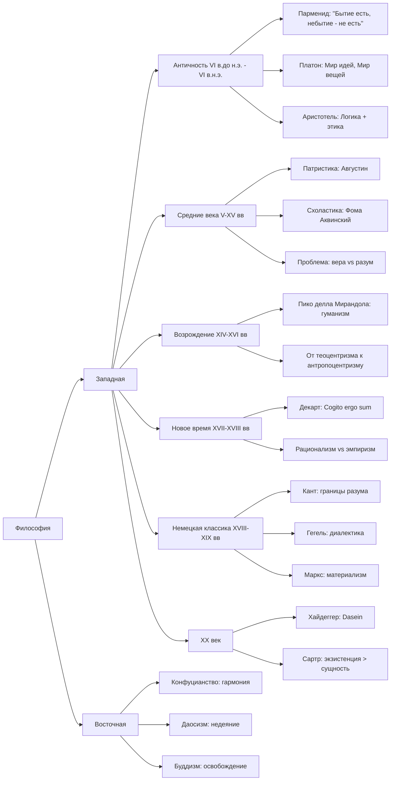

# Подготовка к экзамену по философии

## Общая структура



## Билеты

1. Понятие философии. Философия и критическое мышление.
2. Ранняя греческая философия (на примере концепции Парменида)
3. Греческая философия афинского периода: концепция Платона
4. Греческая философия афинского периода: концепция Аристотеля
5. Философия Средних веков и Возрождения: основная проблематика
6. Философия Нового времени (на примере концепции Р. Декарта)
7. Теоретическая философия И. Канта: "Критика чистого разума"
8. Практическая философия И. Канта: "Критика практического разума"
9. Г.В.Ф.Гегель: диалектический метод (основные принципы)
10. Социальная силософия К. Маркса (на примере "Капитала")
11. Философия XX века: экзистенциализм (М. Хайдеггер, Ж.П.Сартр)

## Структура ответа

В первых же предложениях сформулировать концепцию;  
Не столько важно рассказывать даты и историю, сколько сформулировать и объяснить
проблематику, приести свои примеры.  
Т.е. эказамен <ins>**по проблемам**</ins>, не по тексту/истории.

### Билет 1

#### Понятие философии. Философия и критическое мышление.

##### Проблематика

```text
Философ - это тот, кто научился сомневаться продуктивно,
не впадая в крайности всезнания и пофигизма.
```

##### Объяснение

Итак, начнём с этимологии:

- философия = **фило** + **софия**

С древнегреческого,

- фило - это любовь, стремление
- софия - мудрость

Получается, что философия - это буквально `стремление к мудрости`

Впервые термин насколько я помню использовался Пифагором, это 6 век до нашей
эры.

Контекст состоял в том, что когда Пифагора назвали мудрецом, он ответил что он
не мудрец (софос), а лишь любящий мудрость (философос).

##### Кто такой философ

На лекциях мы вводили 2 как бы "типа" людей, первые два из которых являются
крайностью философа.

1. Софисты (мудрецы).
2. Скептики.

Софисты - считают что обладают абсолютным знанием. Типичный софист в 2025 году
это человек на конференции плоскоземельщиков, который бьёт себя кулаком в грудь
и невзирая на все аргументы говорит что земля действительно таки плоская.

Какова их проблема? Очевидно они закрыты к какому-либо познанию, потому что
считают что они уже всё познали и их знание единственно и неповторимо
(абсолютно). Они не могут сомневаться в собственной мудрости, а как ещё что-то
познать, кроме как через сомнение.

Скептики же наоборот - считают чтоб абсолютного познания не существует как
такового. Почему это крайность спросите вы - да потому что они сомневаются что
вообще можно сомневаться.

Поясню, на примере с плоскощемельщиком - скептик легко разоблачит мудреца
плоскощемельщика и докажет ему что земля не плоская, но вот тут то и нюанс - он
не докажет что земля круглая и не будет искать другой истины, он лишь
опровергнет плоскоземельщика и придёт к тому, что земля никакая, нету истины
потому что.

Итак, **философ находится где-то между софистом и скептиком**. Философ
критически мыслит, сомневается в очевидном, он понимает что не может знать всё,
но также и пытается прийти к какой-то форме истины.

Например, мне очень нравится по этому поводу позиция `Сократа`:

```text
Я знаю, что я ничего не знаю.
```

То есть, как философ, с одной стороны я уже что-то знаю, потому что чтобы
понять, что я ничего не знаю, надо уже что-то да знать. С другой стороны, я как
раз открыт к познанию, говоря что чем больше я знаю, тем больше я буду ничего не
знать.

##### Критическое мышление

Философ должен уметь критически мыслить, но вопрос что это значит. Приведу
пример с практик - на занятиях были организованы дебаты, а также была задача
написать эссе, и в отличие от ЕГЭшного формата, где надо просто согласиться к
автором и прийти к какому-то выводу, на дебатах и в эссе я практиковался
занимать и аргументировать полностью противоположные позиции. Т.е. хороший
философ может ответить и да и нет на один и тот же вопрос, и при этом
аргументированно это обосновать.

**Это и есть критическое мышление** - сомневаться в очевидном, анализировать,
проверять источники, приходить к своим истинам и формулировать собственные
обоснованные выводы.

### Билет 2

#### Ранняя греческая философия (на примере концепции Парменида)

##### Концепция Парменида

Парменид из Элеи первым поставил вопрос о том, что значит существовать и
установил принцип: то, что можно мыслить - существует, а то, что нельзя
мыслить - не существует. Заложил основы логического мышления (показал принцип
непротиворечия), поставил метафизические вопросы.

##### Чуть истории

До Парменида философы задавались вопросами - "Из ЧЕГО состоит мир?"

- Фалес говорил: "Из воды"
- Анаксимен говорил: "Из воздуха"
- Гераклит говорил: "Всё течёт, огонь - первоначало"

Парменид - первый "метафизик" - поднял другой вопрос - не из чего состоит бытие,
а что такое вообще **БЫТИЕ**?

> Понятие метафизики не существовало во времена Парменида и будет введено только
> учениками Аристотеля при анализе работ "после физики" (буквально -
> метафизика).

Если Гераклит говорил что всё течёт, Парменид сказал - ничего не течёт, ничего
не меняется.

Он основал Элейскую школу в Южной Италии, где впервые поставил разум выше
чувств.

##### Логика Парменида

Парменид заложил основу формальной логики: "А не может быть не-А одновременно"

1. Если я думаю о чём-то - это что-то есть в моей мысли
2. Если есть в мысли - то это бытие
3. Небытие НЕЛЬЗЯ помыслить
4. Значит, `Бытие есть, а небытие - не есть`

То есть ещё раз, попробуйте помыслить о "ничём". Не получается! Потому что даже
думая о "ничём", вы думаете о понятии "ничего". Значит, мышление всегда связано
с бытием.

##### Пути познания Парменида

Парменид написал поэму "О природе", где богиня открывает истину:

1. Путь истины (алетейя)

- путь разума и логики
- достоверное знание через _мышление_

2. Путь мнения (докса)

- путь чувств и материального восприятия
- недостоверное знание через _ощущения_

##### Формулировка Парменида

Мы видим что мир изменяется, но логика говорит, что изменение невозможно

Логика:

1. Чтобы измениться, надо _перестать быть_ тем, что ты есть
2. Но `перестать быть` = небытие
3. А небытия - **нет!**
4. Значит, `изменение - иллюзия чувств`

Отсюда получаем,

```text
Истинное бытие - неизменно
Изменения - иллюзия
```

Например, гуляя по парку можно лицезреть кроны деревьев. Летом они зелёные, а
осенью - жёлтые, красные, оранжевые. По Пармениду, это иллюзия чувств - мы
наблюдаем цвета глазами. Истинное бытие листа и кроны из листьев (её сущности)
остаётся неизменным.

##### Вытекает главная проблема Парменида:

Мы видим только изменения. Живём в мире, где всё вокруг постоянно меняется. Как
нам вообще познать истинное бытие, если оно неизменно, а неизменность мы не
видим? Получается, что всё вокруг - иллюзия.

> Эту проблему Парменида потом гениально решил Платон, разделив реальность на
> мир идей (где истина неизменна) и мир вещей (где мы видим изменения).

### Билет 3

#### Греческая философия афинского периода: концепция Платона

##### Концепция Платона

Концепция Платона заключается в теории мира идей, вещей и теней, чтобы решить
проблему Парменида о том, как познать неизменную истину в изменчивом мире.

##### Проблема Парменида

Парменид говорил:

```
Истинное бытие - неизменно
Изменения - иллюзия
```

Отсюда вопрос, как мы вообще живя в изменчивом мире можем познать неизменное
истинное бытие? Получается, что тогда всё это иллюзия.

##### Решение Платона

Платон не отвергает Парменида, а развивает его идеи. Он гениально решает эту
проблему - делит реальность на пирамиду:

1. Мир идей
2. Мир вещей
3. Мир теней

Где тут решение - есть неизменный мир идей, то есть Парменид прав, в котором
истина. Душа бессмертна и до рождения жила в мире идей, то есть знала всю
истину.

При рождении душа "забывает" об истине, она становится заключена в теле
человека. Человек живёт в мире вещей. В нём есть материальные копии, которые
причастны к идеям, отсюда фраза
`бытие - это отношение причастности вещей к идеям`, потому что вещи причастны к
идеям. Т.е. конкретный стол причастен к идее стола. Он имеет некоторую
_"стольность"_.

Познание возможно только с помощью разума - это анамнезис, когда мы
"припоминаем" с помощью разума идеи, которые душа помнила когда-то раньше.

Тут хочется привести интересный пример - это диалог Диогена с Платоном: Диоген
говорит: "Я вижу чашу, но не вижу чашность" На что Платон отвечает: "У тебя есть
глаза, чтобы видеть чашу, но нет разума, чтоб видеть чашность"

Суть тут в том, что чаша - это предмет материального мира. Диоген видит её
своими глазами. А идея чашности может быть познана только через разум.

Дальше чуть про мир теней - это самый низкий уровень познания, когда люди
принимают копии копий, т.е. отражения за реальность.

В реальном мире это например когда мы судим о человеке по его фото в инстаграмме

Чтоб ещё лучше познать концепцию познания мира Платона обратимся к его мифе о
пещере:

Пересказывая вкраце, в нём заключённые сидят спиной к выходу из пещеры и видят
тени происходящих за ними событий. В какой-то момент один из заключённых
освобождается и выходит из пещеры, видит мир таким какой он есть. Но когда
возвращается в пещеру чтоб поведать истинное знание - ему не верят.

Тени на стене - это мир теней, где люди пытаются познать реальность по
отражениям. Предметы за спиной - это мир вещей А солнце снаружи пещеры - это мир
идей.

Отсюда цель философа - поведать обычным людям, живущим в мире теней, об истине,
о мире вещей и идей.

Тут можно привести пример со смешной картинкой (показать на экзамене?), где
заключённые видят отражения осей - windows и macOs, а когда философ выходит из
пещеры - он видит Linux (солнце). Но когда возвращается и говорит им о
существовании такого идеала, ему не верят.

### Билет 4

#### Греческая философия афинского периода: концепция Аристотеля

##### Концепция

Аристотель создал систематическую метафизику, где каждая вещь состоит из материи
(возможности) и формы (действительности), и объясняется через 4 причины, чтобы
решить проблему Платона о том, как идеи связаны с материальным миром.

Хоть Аристотель и был учеником Платона, он по итогу его как бы переосмыслил,
придумав основу для всех наук и систематизировав их, а также решил проблему
Платона

##### Проблема Платона

Если идеи в отдельном мире, как они влияют на наш, материальный мир? Как стол
связан с идеей стола?

Решение Аристотеля: "Идеи не в отдельном мире, а в САМИХ ВЕЩАХ как слияние формы
с материей"

Пример: конкретный стол = материя (дерево) + форма (идея стола) => не нужен
отдельный "мир идей"

##### Метафизика Аристотеля

Это теория всего, о началах всего

Главный вопрос: "Что есть сущее?"

Сущее разделяется на 10 категорий, которые делятся на 2 группы:

1. Безусловное сущее - сущность (лат. `субстанция`)

   - ЧТО это? => **стол, собака, человек, камень**
   - существует _само по себе_

2. Остальные 9 существуют как _отношение сущности_ - привходящее-приключение
   (то, что приходит к субстанции) (лат. `акцинденция`): место, время,
   количество, качество, ...
   - То, что существует _ТОЛЬКО В ДРУГОМ_
   - ГДЕ? => **в комнате**
   - КОГДА? => **сегодня**
   - СКОЛЬКО? => **один**
   - КАКОЙ? => **КОРИЧНЕВЫЙ**

Резюмируя,

```text
Сущность существует сама по себе
Акциденции зависят от сущности
```

Простой тест: "Может ли это существовать отдельно?"

1. "Да!" => Субстанция (e.g. Стол)
2. "Нет!" => акциденция (e.g. один, коричневый; <- тут нужно зависимое)

Также, сущее может быть описано как:

- сущее возможности (греч. `дюнамис`) - слабее
  - то, чем вещь МОЖЕТ СТАТЬ
  - потенциал, ещё не реализованный
- сущее действительности (греч. `энергия`) - сильнее, основание для возможности
  - то, чем вещь УЖЕ ЯВЛЯЕТСЯ
  - реализованный потенциал

Возможное начало сущности - материя  
Действительное начало сущности - форма

```text
Желудь может стать дубом только потому,
что УЖЕ ЕСТЬ ВЗРОСЛЫЕ ДУБЫ

Получается, что возможности определяются тем,
что УЖЕ СУЩЕСТВУЕТ В ДЕЙСТВИТЕЛЬНОСТИ

Возможное начало жёлудя - это его материя,
  древесное вещество, клетчатка

Действительное начало жёлудя - это его форма,
  "дубовость", программа стать дубом
```

##### 4 причины описания сущего

Так что принципиально нового в метафизике?

Надо осмыслить причины всего мира, т.к. Платон так этого и не сделал

есть 4 причины чтоб описать сущее <=> 4 начала всего на свете

1. Материальная причина (из чего всё произошло?). Материя - вечна. Её нелььзя
   создать/уничтожить. (**ЭТО И ЕСТЬ ДЮНАМИС - ВОЗМОЖНОСТЬ**)
2. Формальная причина (что всё определяет? сущность?). Придаёт материи форму.
   Есть первоформа - источник остальных форм. Некий ум, или "Бог". Тут и
   схожесть и разница с Платоном. Но если Платон придумал отделное царство - мир
   идей. То у Аристотеля форма сливается с материей в конкретном предмете.
   (**ЭТО И ЕСТЬ ЭНЕРГИЯ - ДЕЙСТВИТЕЛЬНОСТЬ**)
3. Производщящая причина. То, откуда всё происходит. Бог, большой взрыв, или
   какой-то другой источник вселенной.
4. Конечная цель. То, ради чего всё существует. У каждой вещи есть своя цель
   существования. Для чеовека это смысл жизни, а высшая цель всего - есть Благо.

Итак, `желудь`,

1. Материальная - древесное вещество
2. Формальная - идея дуба (форма)
3. Производящая - солнце, вода
4. Целевая - стать дубом

##### Система наук Аристотеля

Есть 3 вида наук - теоретические, практические, творческие

теоретические - знания ради знаний (математика, физика, метафизика)
практические - знания ради пользы (политика, этика)  
поэтические - развитие творчества, создание предметов искусства (риторика,
искусство)

Интересный факт: во время Аристотеля метафизики ещё не существовало, поэтому он
назвал её "первой философией" - потому что она и есть начала, теория всего. А
слово метафизика придумали его ученики, когда нашли его рукописи буквально "то,
что после физики".

##### Иерархия Бытия Аристотеля

Чем больше формы над материей, тем выше в иерархии:

- Камень - мало формы, много материи
- Растение - больше формы (растет к цели)
- Животное - еще больше формы (движется, чувствует)
- Человек - много формы (разум)
- БОГ - чистая форма, никакой материи

##### БОГ КАК "НЕПОДВИЖНЫЙ ДВИГАТЕЛЬ"

- Парадокс движения: Кто движет все во вселенной?
- Решение Аристотеля: Бог не движется сам (**он совершенен**), но движет все
  остальное, как предмет любви движет влюбленного.
- В Боге нет возможности - только чистая действительность, все уже реализовано.

##### ЭНТЕЛЕХИЯ

Внутренняя цель - сила, которая ведет к совершенству.

Пример: В желуде есть энтелехия дуба - сила, которая делает его дубом, а не
березой.

##### Ответ Аристотеля на Апорию Зенона

> Апория - это неразрешимая логическая проблема Зенон - ученик Парменида,
> который его защищал

Условие: Ахиллес догоняет черепаху, которая имеет фору

Пока Ахиллес добежит до точки А, где была черепаха, она уползёт до точки Б. Пока
добежит до Б, она уползёт в В Пока добежит до В, она уползёт в Г И так далее...
Вывод: Ахиллес НИКОГДА не догонит черепаху

Ответ Аристотеля: Зенон путает Математическое деление и Физическое движение,
ошибочно предполагая что если математически можно делить бесконечно, то и
физически нужно бесконечное время.

Пример: Математически путь можно поделить на бесконечное количество отрезков, а
физически этот путь преодолеть за 10 секунд.

##### ПРОСТАЯ СХЕМА СВЯЗЕЙ

```text
КАЖДАЯ ВЕЩЬ состоит из:

МАТЕРИЯ = ДЮНАМИС = ВОЗМОЖНОСТЬ = МАТЕРИАЛЬНАЯ ПРИЧИНА
    ↓
ФОРМА = ЭНЕРГИЯ = ДЕЙСТВИТЕЛЬНОСТЬ = ФОРМАЛЬНАЯ ПРИЧИНА

+ ДВИЖУЩАЯ ПРИЧИНА (кто запустил)
+ ЦЕЛЕВАЯ ПРИЧИНА (зачем)
```

##### СВЯЗЬ С ИСКУССТВОМ

- Классическое искусство - торжество формы над материей (четкие пропорции,
  симметрия, идеальная перспектива, подавление эмоций ради красоты, логическая
  композиция).
- Барокко, романтизм - избыток материи над формой (эмоции, хаос, резкие
  светотени, нарушение симметрии ради драматизма).

Например, девятый вал - избыток материи над формой. Важно показать мощь морской
бури, пробивание восхода солнца, людей на обломках после краблекрушения,
перезать ужас стихии и надежду на спасение людей, передать динамику и хаос
стихии. Картина заставлвяет переживать, а не любоваться пропорциями.

### Билет 5

#### Философия Средних веков и Возрождения: основная проблематика
